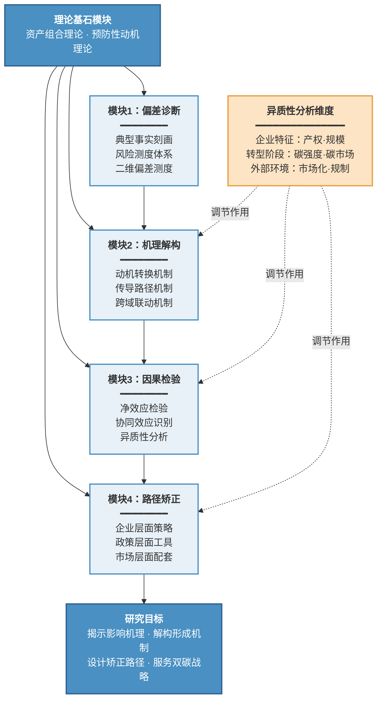

```mermaid
flowchart TB
    A["<b>理论基石模块</b><br/>资产组合理论 · 预防性动机理论"]
    
    A --> B1
    A --> B2
    A --> B3
    A --> B4
    
    B1["<b>模块1：偏差诊断</b><br/>━━━━━━━━<br/>典型事实刻画<br/>风险测度体系<br/>二维偏差测度"]
    B2["<b>模块2：机理解构</b><br/>━━━━━━━━<br/>动机转换机制<br/>传导路径机制<br/>跨域联动机制"]
    B3["<b>模块3：因果检验</b><br/>━━━━━━━━<br/>净效应检验<br/>协同效应识别<br/>异质性分析"]
    B4["<b>模块4：路径矫正</b><br/>━━━━━━━━<br/>企业层面策略<br/>政策层面工具<br/>市场层面配套"]
    
    B1 --> B2
    B2 --> B3
    B3 --> B4
    
    C["<b>异质性分析维度</b><br/>━━━━━━━━━━━━━━━<br/>企业特征：产权·规模<br/>转型阶段：碳强度·碳市场<br/>外部环境：市场化·规制"]
    
    C -.调节作用.-> B2
    C -.调节作用.-> B3
    C -.调节作用.-> B4
    
    B4 --> D["<b>研究目标</b><br/>揭示影响机理 · 解构形成机制<br/>设计矫正路径 · 服务双碳战略"]
    
    style A fill:#4A90C2,stroke:#2C5F8D,stroke-width:2px,color:#fff
    style B1 fill:#E8F1F8,stroke:#4A90C2,stroke-width:2px
    style B2 fill:#E8F1F8,stroke:#4A90C2,stroke-width:2px
    style B3 fill:#E8F1F8,stroke:#4A90C2,stroke-width:2px
    style B4 fill:#E8F1F8,stroke:#4A90C2,stroke-width:2px
    style C fill:#FCE4C4,stroke:#E89B3C,stroke-width:2px
    style D fill:#4A90C2,stroke:#2C5F8D,stroke-width:2px,color:#fff
  
```